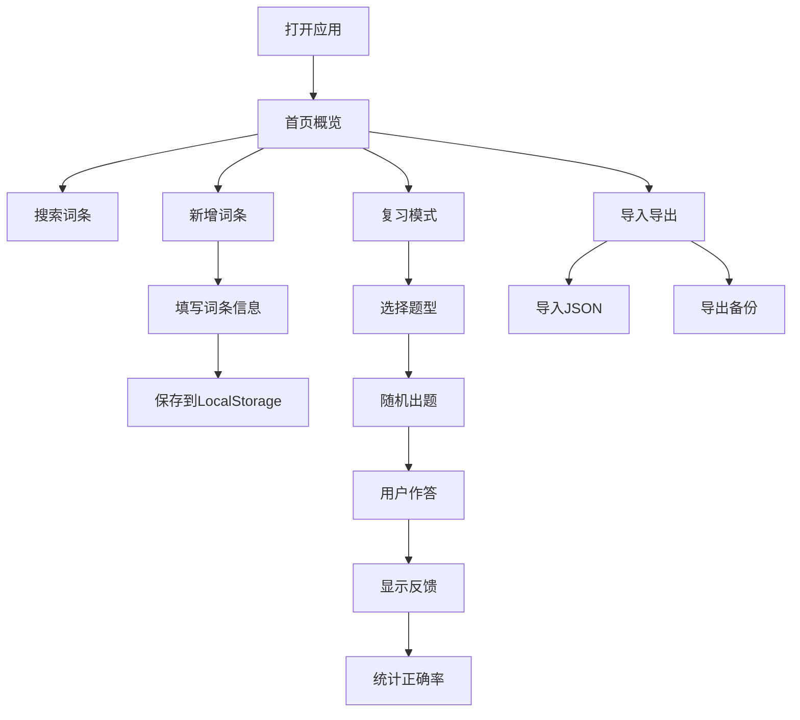

## 1. 产品概述

个人输入法词库管理工具，帮助用户收录易错词、行业术语、朋友昵称等自定义词条，通过复习模式纠正输入习惯，提升打字准确率。

- 核心价值：解决个人打字易错、专业术语输入不便的痛点，通过主动复习强化肌肉记忆
- 目标用户：打字员、文案工作者、程序员、有大量专业术语需求的从业者

## 2. 核心功能

### 2.1 用户角色
| 角色 | 注册方式 | 核心权限 |
|------|----------|----------|
| 普通用户 | 无需注册，直接使用 | 词条管理、分组管理、复习模式、导入导出、搜索联想 |

### 2.2 功能模块
1. **首页/搜索页**：搜索联想、快速入口导航、词条概览
2. **词条管理页**：词条列表、新增/编辑/删除词条、分组筛选
3. **复习模式页**：随机出题、选择题/填空题模式、答题反馈、正确率统计
4. **导入导出页**：批量导入JSON、导出JSON/纯文本词库、数据备份恢复

### 2.3 页面详情
| 页面名称 | 模块名称 | 功能描述 |
|---------|----------|----------|
| 首页 | 搜索框 | 支持拼音首字母、关键字实时联想匹配 |
| 首页 | 快速入口 | 一键进入复习模式、新增词条、导入导出 |
| 首页 | 数据概览 | 显示各分组词条数量、复习完成度统计 |
| 词条管理 | 词条列表 | 展示词条详情（正确写法、错法、首字母、场景），支持分页 |
| 词条管理 | 分组筛选 | 按工作术语/朋友昵称/生僻字/网络梗筛选 |
| 词条管理 | 词条表单 | 新增/编辑词条，支持多个常见错法录入 |
| 复习模式 | 题型选择 | 选择题模式 / 填空题模式切换 |
| 复习模式 | 答题界面 | 随机出题，显示正确/错误反馈，自动下一题 |
| 复习模式 | 结果统计 | 本轮正确率、错题回顾、重新开始 |
| 导入导出 | 批量导入 | 支持JSON格式批量导入，数据校验 |
| 导入导出 | 数据导出 | 导出JSON备份、导出纯文本词库文件 |
| 导入导出 | 数据管理 | 清空所有数据、重置功能 |

## 3. 核心流程

用户打开应用 → 查看首页概览 → 可选择搜索词条/新增词条/进入复习/导入导出
→ 新增词条：填写正确写法、常见错法、拼音首字母、使用场景、选择分组 → 保存到本地存储
→ 复习模式：选择题型 → 系统随机抽取词条出题 → 用户作答 → 显示对错 → 统计结果
→ 导入导出：导入JSON批量添加 / 导出数据备份到本地

## 4. 用户界面设计

### 4.1 设计风格
- **主色调**：深海蓝 (#1e3a5f) 搭配薄荷绿 (#2dd4bf) 作为强调色
- **辅助色**：珊瑚橙 (#fb923c) 用于错误提示，浅灰蓝 (#f1f5f9) 作为背景
- **按钮风格**：圆角胶囊按钮，带有微妙的悬浮阴影效果
- **字体**：标题使用 Noto Serif SC（宋体），正文使用 JetBrains Mono（等宽字体）
- **布局风格**：卡片式布局，顶部导航标签页切换，左侧边栏分类
- **图标风格**：使用 emoji 图标增强亲切感，如 📝、🔍、🎯、💾

### 4.2 页面设计概述
| 页面名称 | 模块名称 | UI元素 |
|---------|----------|--------|
| 首页 | 搜索区域 | 大圆角搜索框，输入时下拉联想列表，渐入动画 |
| 首页 | 统计卡片 | 四个彩色统计卡片，悬浮放大效果，显示分组数量 |
| 词条管理 | 列表区域 | 斑马条纹表格，hover高亮，支持批量选择 |
| 词条管理 | 表单弹窗 | 毛玻璃效果弹窗，表单字段分区展示 |
| 复习模式 | 答题卡片 | 大卡片居中，选项按钮带边框动画，正确时绿色光晕 |
| 导入导出 | 文件区域 | 拖拽上传区域，虚线边框，文件拖入时高亮 |

### 4.3 响应式
- 桌面优先设计，1280px 以上最佳体验
- 平板端：侧边栏折叠为图标模式
- 移动端：顶部导航转为底部Tab，卡片单列布局
- 所有交互元素最小 44px 触控区域

## 5. 功能交互细节

### 5.1 搜索联想
- 输入拼音首字母（如"zgrm"）匹配"中华人民共和国"
- 输入关键字（如"程序"）匹配含该字的所有词条
- 下拉列表显示：正确写法 + 常见错法 + 分组标签
- 支持键盘上下键选择，回车快速查看

### 5.2 复习模式
- **选择题**：显示正确写法的拼音首字母，4个选项包含1个正确写法和3个干扰项
- **填空题**：显示常见错法，要求填写正确写法，支持拼音联想辅助
- 答题后立即显示反馈，正确显示✓，错误显示✗并给出正确答案
- 错题自动加入错题库，可针对性复习

### 5.3 数据存储
- 所有数据存储于浏览器 LocalStorage
- 数据结构：词条列表、分组配置、复习记录
- 自动定时保存，防止数据丢失
