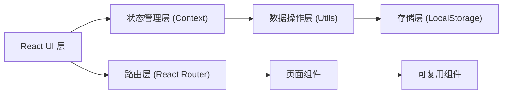
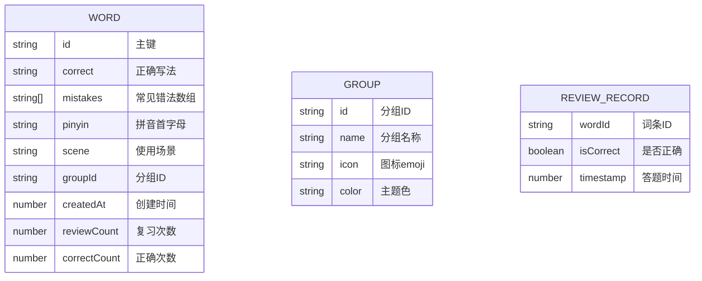

## 1. 架构设计

纯前端单页应用，无后端服务，数据存储于浏览器 LocalStorage。采用 React 组件化架构，状态管理使用 React Context + useReducer。



## 2. 技术描述

- **前端框架**：React@18 + TypeScript
- **构建工具**：Vite@5
- **样式方案**：TailwindCSS@3
- **路由管理**：React Router DOM@6
- **状态管理**：React Context + useReducer
- **拼音匹配**：pinyin-pro 库（拼音转换与匹配）
- **图标**：Lucide React

## 3. 路由定义

| 路由 | 页面 | 功能 |
|------|------|------|
| `/` | 首页 | 搜索联想、数据概览、快速入口 |
| `/words` | 词条管理 | 词条列表、增删改查、分组筛选 |
| `/review` | 复习模式 | 选择题、填空题、正确率统计 |
| `/import-export` | 导入导出 | 批量导入、导出备份、数据管理 |

## 4. 数据模型

### 4.1 数据模型定义



### 4.2 TypeScript 类型定义

```typescript
interface Word {
  id: string;
  correct: string;
  mistakes: string[];
  pinyin: string;
  scene: string;
  groupId: string;
  createdAt: number;
  reviewCount: number;
  correctCount: number;
}

interface Group {
  id: string;
  name: string;
  icon: string;
  color: string;
}

interface ReviewRecord {
  wordId: string;
  isCorrect: boolean;
  timestamp: number;
}

interface AppState {
  words: Word[];
  groups: Group[];
  reviewRecords: ReviewRecord[];
}

type QuestionType = 'choice' | 'fill';

interface Question {
  word: Word;
  type: QuestionType;
  options?: string[];
  userAnswer?: string;
  isCorrect?: boolean;
}
```

## 5. 核心模块设计

### 5.1 存储模块 (storage.ts)

- `loadFromStorage<T>(key: string, defaultValue: T): T`
- `saveToStorage<T>(key: string, data: T): void`
- `clearStorage(): void`

### 5.2 数据操作模块 (wordService.ts)

- `addWord(word: Omit<Word, 'id' | 'createdAt' | 'reviewCount' | 'correctCount'>): Word`
- `updateWord(id: string, updates: Partial<Word>): void`
- `deleteWord(id: string): void`
- `searchWords(keyword: string): Word[]`
- `getRandomWords(count: number, groupId?: string): Word[]`
- `importWords(words: Word[]): { success: number; failed: number }`
- `exportToJSON(): string`
- `exportToText(): string`

### 5.3 拼音匹配模块 (pinyinHelper.ts)

- `getPinyinInitials(text: string): string`
- `matchByPinyin(word: Word, keyword: string): boolean`
- `matchByKeyword(word: Word, keyword: string): boolean`

### 5.4 复习模式模块 (reviewService.ts)

- `generateChoiceQuestion(word: Word, allWords: Word[]): Question`
- `generateFillQuestion(word: Word): Question`
- `checkAnswer(question: Question, answer: string): boolean`
- `saveReviewRecord(wordId: string, isCorrect: boolean): void`

## 6. 初始数据

默认分组配置：

```json
{
  "groups": [
    { "id": "work", "name": "工作术语", "icon": "💼", "color": "#1e3a5f" },
    { "id": "friends", "name": "朋友昵称", "icon": "👥", "color": "#2dd4bf" },
    { "id": "rare", "name": "生僻字", "icon": "📚", "color": "#fb923c" },
    { "id": "meme", "name": "网络梗", "icon": "🎮", "color": "#a78bfa" }
  ]
}
```

## 7. 项目结构

```
src/
├── components/          # 可复用组件
│   ├── Layout.tsx       # 布局组件
│   ├── WordCard.tsx     # 词条卡片
│   ├── WordForm.tsx     # 词条表单
│   ├── SearchBox.tsx    # 搜索框
│   ├── StatCard.tsx     # 统计卡片
│   └── Modal.tsx        # 弹窗组件
├── pages/               # 页面组件
│   ├── Home.tsx         # 首页
│   ├── WordList.tsx     # 词条管理
│   ├── Review.tsx       # 复习模式
│   └── ImportExport.tsx # 导入导出
├── context/             # 状态管理
│   └── AppContext.tsx
├── services/            # 业务逻辑
│   ├── storage.ts
│   ├── wordService.ts
│   ├── pinyinHelper.ts
│   └── reviewService.ts
├── types/               # 类型定义
│   └── index.ts
├── App.tsx
├── main.tsx
└── index.css
```
